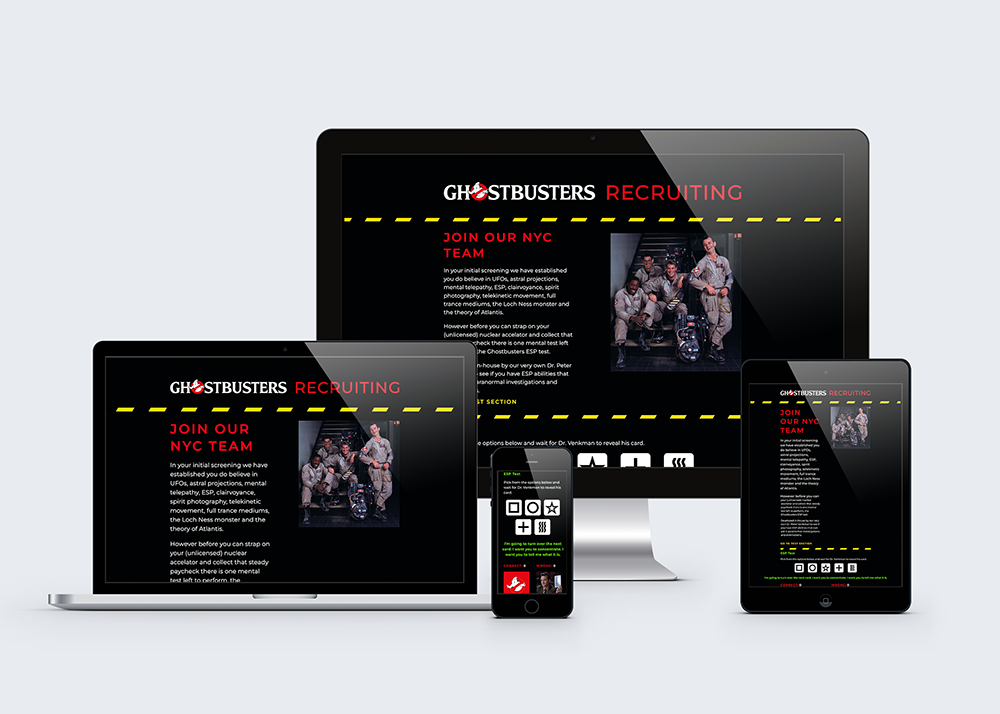
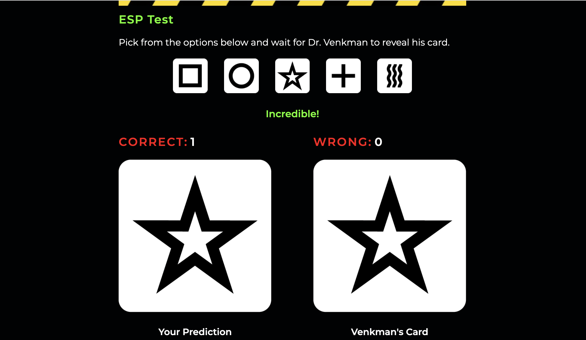
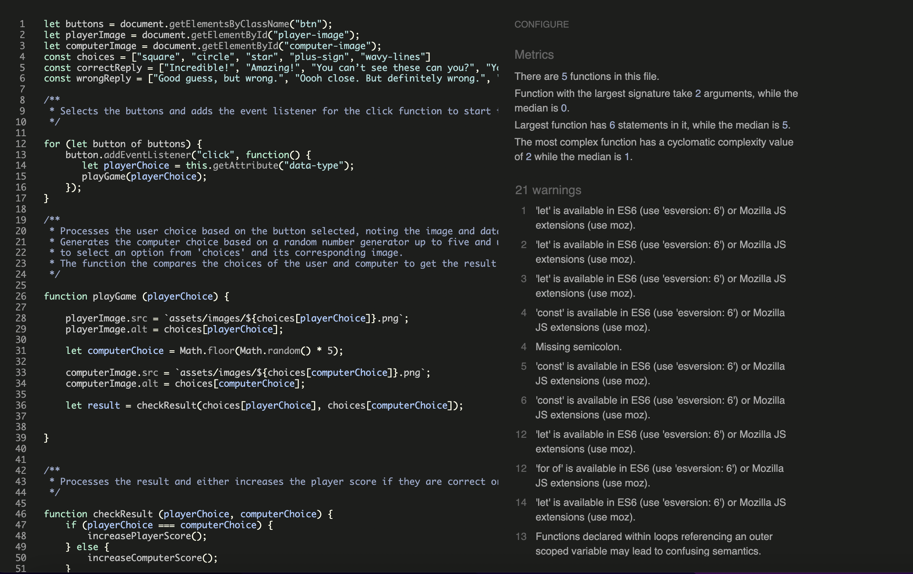
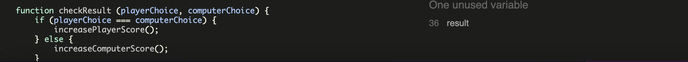
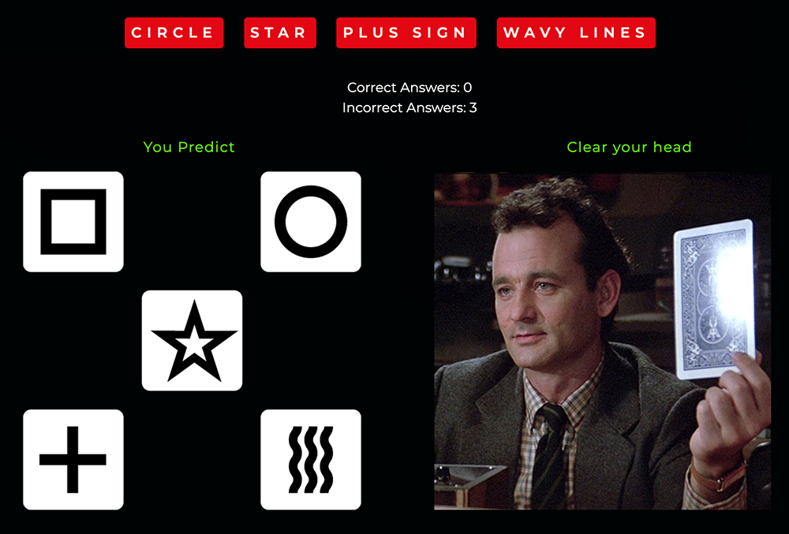
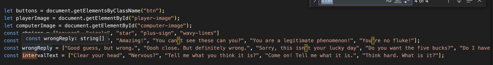
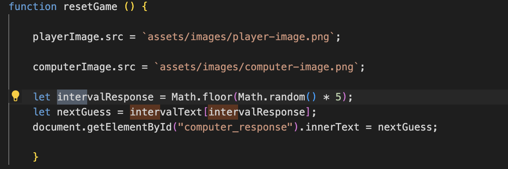

# Ghostbusters ESP Test Game

Live site: https://tberrigan2101.github.io/project-two/

A game based on the same principles as 'Rock, Paper, Scissors' but with a twist based on inspiration from a recent Halloween viewing of the 1984 film 'Ghostbusters'

The game is based on the [ESP Test Scene](https://youtu.be/HW8Ua49dCYk) of the movie when Dr. Peter Venkman (Bill Murray) is performing an ESP (Extrasensory perception, or sixth sense) test with two volunteers that have to guess the symbol on the card Dr. Venkman is holding.

  

## 1. Features 

- __Theme and Colour Scheme__

  - I based the colour scheme on colours associated with the Ghostbusters branding such as the red and white from the famous Ghostbusters logo, green to represent a 'slime' colour and the yellow and black angled lines with smoke as seen on the trap prop from the film.

  

  
- __Header and Introduction__

  - I created a logo for the top of the page as 'Ghostbusters Recruiting' with the concept that this page would effectively be a fictional recruitment page to hire potential new Ghostbusters. I used lines and references from the film for effect and then explained that in order to successfully join the team the applicant would need to attempt the ESP test on the page.

- __Game Options__

  - The instructions state to choose from one of five options by clicking on the interactive buttons below in an attempt to successfully match the symbol on the card the Dr. Venkman (the computer) is theoretically holding. The five options are based on symbols mentioned in the film and created by me in Adobe Illustrator.

  - The five options are.

  

- __The Game Mechanics__

  - When the user picks their option, their choice is shown on the left side of the screen. 

   - The computer using a random option in the playGame() function then chooses an image from the const 'choices' declaration and displays its choice on the right side of the screen.

   - Depending on the result, the player score or the computer score increases accordingly along with a message from Dr. Venkman congratulating or commiserating them depending on the result, again using lines from the film.

  

## 2. Future features

- It was proposed by my mentor that I created an overlay div for the buttons once the buttons are clicked to avoid the user pressing the button too quickly after picking their option.

- I would like to reintroduce the 'interval' feature that I mention in the bugs section below.

- I would like to have some type of animation for revealing the cards.

## 3. Technology Used
- HTML
- CSS
- Javascript

## 4. Testing 

Below are my results from testing the site both structurally and visually.

### 4.1 Code Validation

- HTML
  - No errors were returned when passing through the official [W3C validator](https://validator.w3.org/nu/?doc=https%3A%2F%2Ftberrigan2101.github.io%2Fproject-two%2F)

- CSS
  - No errors were found when passing through the official [(Jigsaw) validator](https://jigsaw.w3.org/css-validator/validator?uri=https%3A%2F%2Ftberrigan2101.github.io%2Fproject-two%2F&profile=css3svg&usermedium=all&warning=1&vextwarning=&lang=en)

- Javascript
  - I passed my code through [JShint](/https://jshint.com/) and I got 21 warnings but when I discussed them with my mentor he said I shouldn't worry about them in the case of this project
    
  - I did get a note on an unused variable but whenever I tried to edit or remove this the game stopped working so I will need to revisit it again to understand what the reason might be.
    

### 4.2 User observations

- The people I tested the site with found the site easy to navigate and it felt relatively intuitive and the content made sense.

- One of the major issues that was flagged with me was I originally had text buttons for the game options and an image on the left showing the visuals of the icons and users thought this image was interactive so they bypassed the text buttons and clicked on the icon display graphic which wasn't an active button. After that I decided to remove the text buttons from the menu and just use the individual icons as buttons and replaced the player image on the left side wih the Ghostbusters graphic so users would understand what they had to select.

  

### 4.3 Bugs

   - I had initially designed an 'interval' function to the game where I wanted to replicate Dr. Venkman holding up a new card each time before the player makes their next guess and for this I created a function called 'resetGame'. This function would reset the player and computer images to their original state and would prompt the computer to speak another line from the movie that prepared the user to take another guess ('Clear your head','Nervous?' etc) so the user felt they were taking turns with a new card each time.

     
     

   - I set a timeout of 2 seconds for resetGame() in the playGame (playerChoice) function so each time the user made a choice the game would reset in two seconds but retain the scores. The correct responses were being generated from the string I createed but the buttons were still live and my mentor pointed out that it wasn't obvious that the player had to wait for the images to reset before taking their next turn and could keep making guesses potentially creating confusion.

    - We discussed different approaches such as trying to temporarily remove the Event Listener from the buttons, adding an overlay to the buttons so the player couldn't access them until the game reset and hiding the div that held the buttons after each click. 

     - Unfortunately all of my attempts at trying to make this work failed and while I wanted to try and push the game further I felt it was better to remove the 'interval' feature completely as it didn't take anything away from the basic game functionality but leaving it in the game could cause problems for the user.

### 4.4 Supported Screens and Browsers

- I tested the site using Chrome, Safari and Firefox and all browsers tested fine.

### 4.5 Performance Testing

- Initial test for the site was good and there were a few small changes to be made, mostly image sizing that I compressed to the point where I thought they wouldn't be compromised. Following those changes I got these results from Lighthouse.

## 5. Deployment

- The site was deployed to GitHub pages. The steps to deploy are as follows: 
  - In the GitHub repository, navigate to the Settings tab 
  - From the source section drop-down menu, select the Master Branch
  - Once the master branch has been selected, the page will be automatically refreshed with a detailed ribbon display to indicate the successful deployment. 

The live link can be found here - https://tberrigan2101.github.io/project-two/

## 6. Credits 

In this section I will break down the credits for my project. 

### 6.1 Code

- I reused some of the code for the footer social media icons from my last project which was developed from the code on the [Love Running](https://learn.codeinstitute.net/courses/course-v1:CodeInstitute+LR101+2021_T1/courseware/4a07c57382724cfda5834497317f24d5/f2db5fd401004fccb43b01a6066a5333/) example project from Code Institute.

- I built some of the code based on the code shown in the [Rock Paper Scissors](https://learn.codeinstitute.net/courses/course-v1:CodeInstitute+JSE_PAGPPF+2021_Q2/courseware/30137de05cd847d1a6b6d2c7338c4655/c3bd296fe9d643af86e76e830e1470dd/) example project from Code Institute.

 - The code I originally used to develop the timeout feature in the function resetGame() was taken from [here](https://www.w3schools.com/js/js_timing.asp)

### 6.2 Fonts

- All fonts were imported from [Google Fonts](https://fonts.google.com/about)

### 6.3 Written Content 

- While I edited or wrote all the text, it contains references derived directly from quotes from the film which I sourced from a transcript [here](https://movies.fandom.com/wiki/Ghostbusters/Transcript).

- The icons in the footer were taken from [Font Awesome](https://fontawesome.com/)

### 6.4 Media

- The header logo was designed by me using a vector of the Ghostbusters logo from [here](https://www.brandsoftheworld.com/logo/ghostbusters-6)

- The image of the Ghostbusters cast was taken from [here](https://imgur.com/gallery/siIqH8C)

- The image of Peter Venkman (Bill Murray) was taken from [here](https://www.comingsoon.net/movies/news/1109307-bill-murray-confirmed-for-ghostbusters-2020-return#/slide/1)

- The image I used to create the green smoke at the bottom of the page was taken from [here](https://www.pngitem.com/middle/TTJwT_grey-smoke-png-transparent-image-smoke-transparent-background/)

- The icons for the buttons were designed by me in Adobe Illustrator.

### 6.5 Acknowledgements

- I would like to thank my Code Institute mentor Rohit Sharma for all of his help throughout the project.

